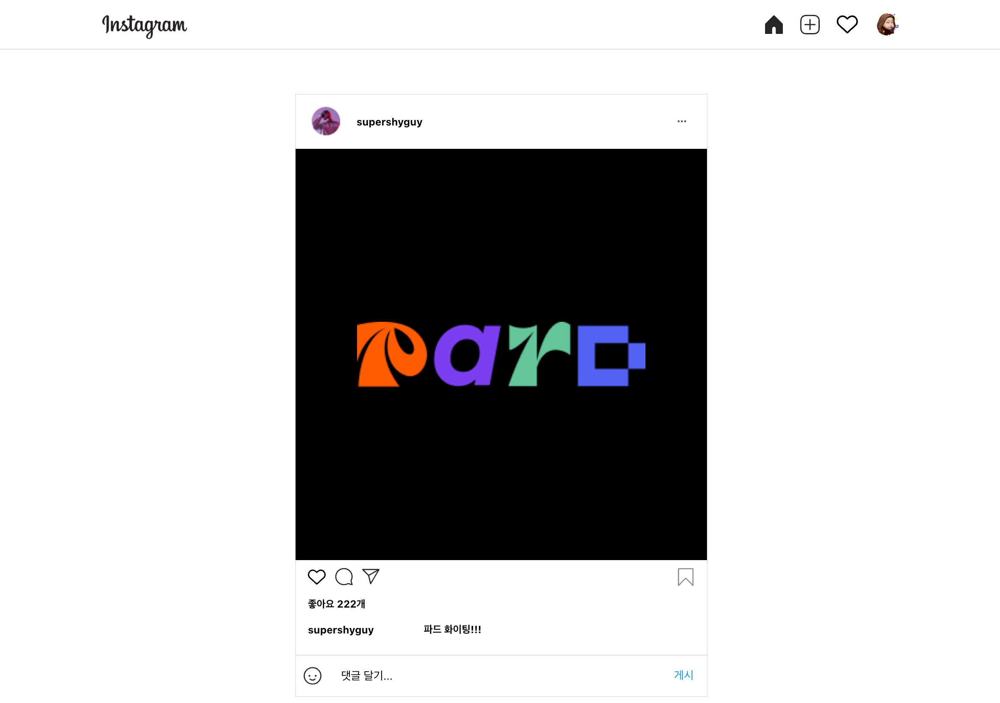

Instagram Clone Coding
============

</img>  

## What is Instagram Clone Coding?
- 리액트를 활용하여 인스타그램 웹페이지를 구현해보는 프로젝트

 

## Used React Features
- JSX
- Styled Component
- Props
- Hook
- Routing
- Context
- Media Query

 

## Project Feature
- 홈 페이지
- 마이 페이지
- 프로필 업데이트 페이지

 

## Development Environment & Programming Language
- React
- JavaScript
- Vscode

 

## Version
- 4.3
